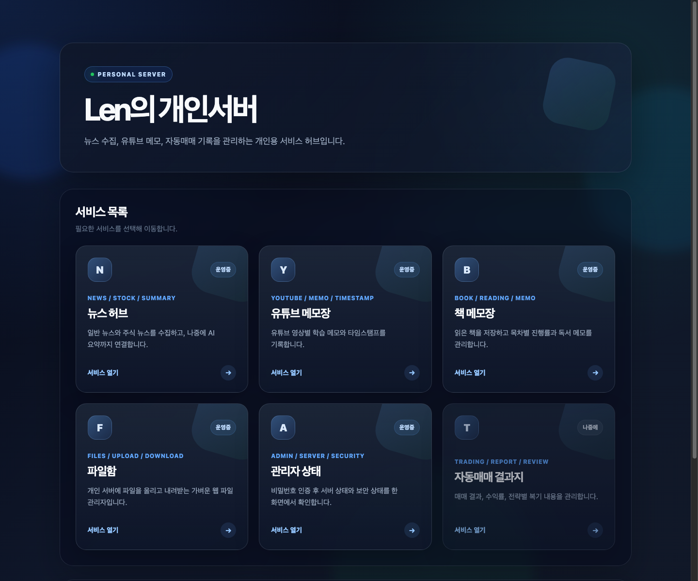
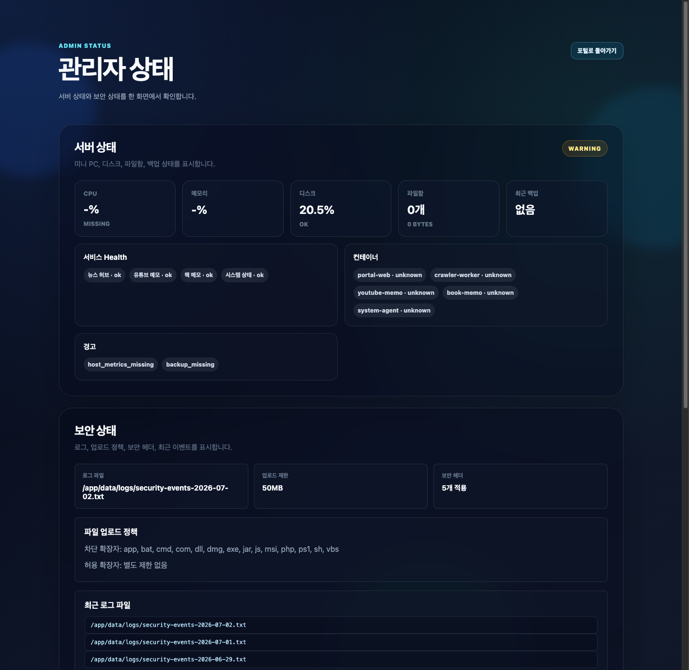
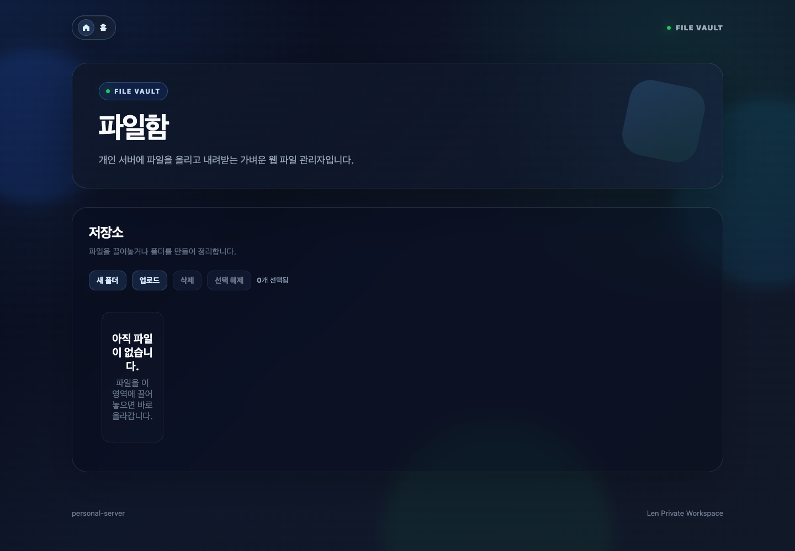
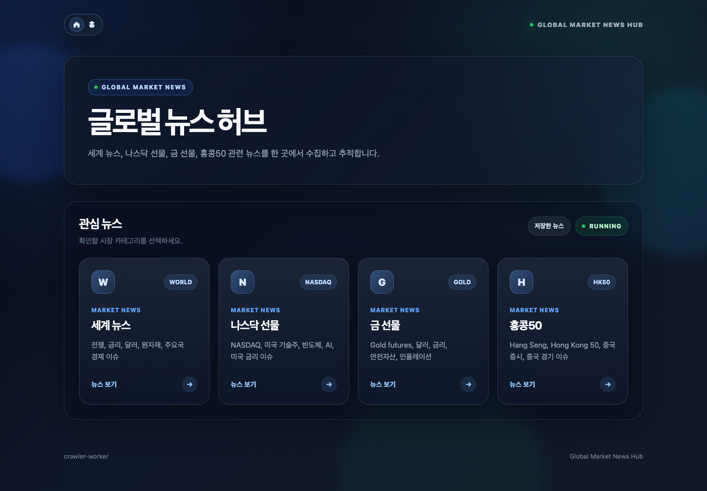
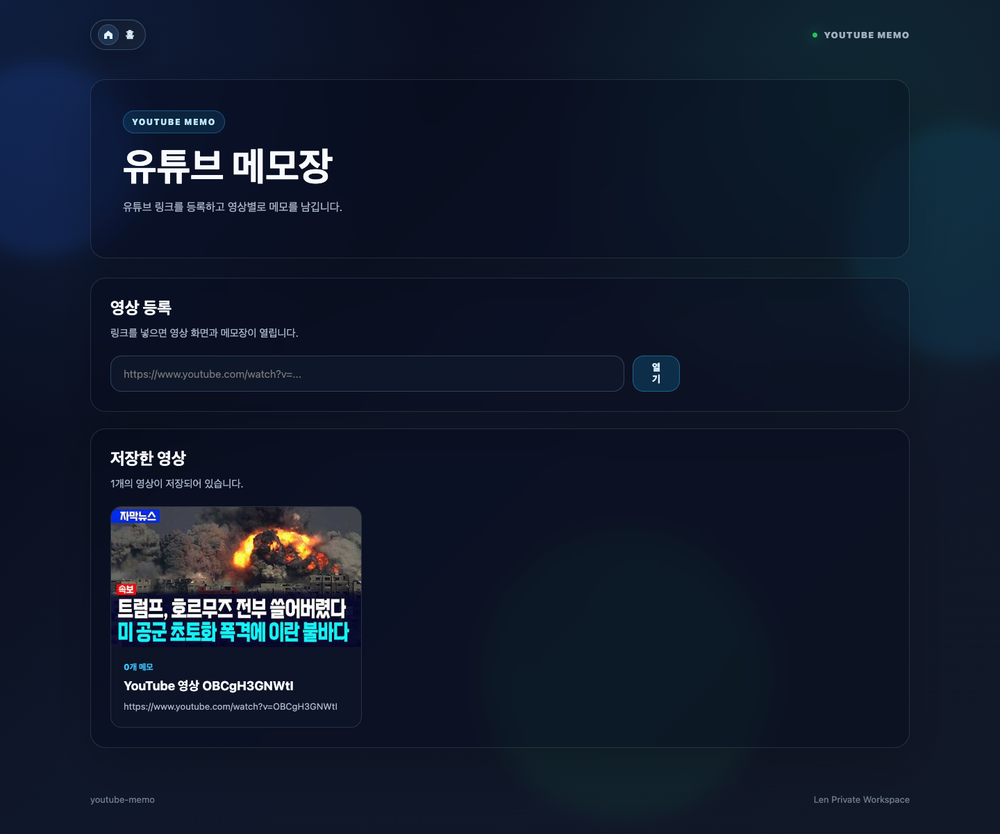
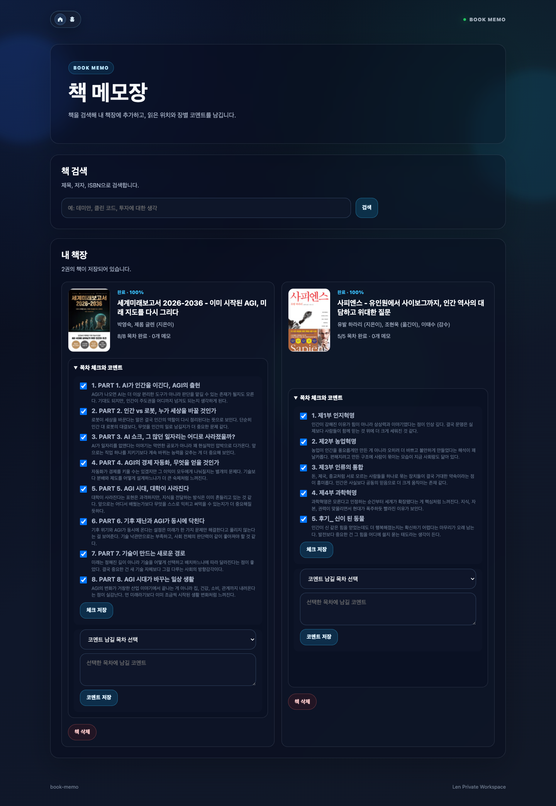

# personal-server

개인용 서비스들을 Docker Compose로 묶어 운영하는 프로젝트입니다.

## 서비스

- `portal-web` (`8000`): 개인 서버 메인 포털
- `portal-web /admin/status` (`8000`): 관리자 인증 기반 서버/보안 상태 페이지
- `portal-web /files` (`8000`): 웹 파일 업로드/다운로드 파일함
- `system-agent` (`8010`): N100/Windows host metrics, 백업/파일함/컨테이너 상태 API
- `crawler-worker` (`8001`): Google News RSS 수집, AI 요약, 저장 뉴스 관리
- `youtube-memo` (`8002`): YouTube 링크별 메모장
- `book-memo` (`8003`): 책 검색, 독서 진행률, 목차별 코멘트, 독서 메모

## 화면 예시

### 포털 화면



개인 서버의 메인 허브입니다. 운영 중인 서비스 목록을 한 화면에서 확인하고, 파일함, 메모 서비스, 관리자 상태 페이지로 이동할 수 있습니다.
홈 화면은 서비스 진입과 전체 검색에 집중하고, 민감한 서버/보안 상태는 관리자 인증 화면으로 분리합니다.

### 관리자 상태



관리자 비밀번호 인증 후 서버 상태와 보안 상태를 한 화면에서 확인하는 운영 페이지입니다.
CPU/메모리/디스크, 파일함 규모, 백업 상태, Docker 컨테이너 상태, 서비스 Health, 최근 경고, 업로드 정책, 보안 헤더, 최근 보안 이벤트를 함께 표시합니다.

### 파일함



개인 서버에 파일을 올리고 내려받는 웹 파일 관리자입니다. 업로드 크기 제한, 차단 확장자, 덮어쓰기 방지, 일별 보안 로그 기록을 적용했습니다.
윈도우 탐색기처럼 폴더를 만들고, 파일을 드래그 앤 드롭으로 올릴 수 있습니다.

### 뉴스 허브



Google News RSS 기반으로 글로벌 뉴스와 시장 뉴스를 수집합니다. 저장한 뉴스 검색과 AI 요약 흐름을 붙일 수 있도록 서비스와 데이터 저장 계층을 분리했습니다.

### 유튜브 메모



유튜브 링크별로 학습 메모를 관리하는 서비스입니다. 영상 단위로 메모를 쌓고 다시 찾아볼 수 있게 구성했습니다.

### 책 메모



책 검색, 독서 상태, 진행률, 목차별 코멘트와 독서 메모를 관리합니다. 알라딘, Google Books, Open Library 검색 fallback을 지원합니다.

## 데이터

런타임 데이터는 루트 `data/` 아래에 둡니다.

- `data/crawler-worker/news_summaries.sqlite3`: 저장 뉴스/요약 DB
- `data/youtube-memo/youtube_memo.sqlite3`: YouTube 영상/메모 DB
- `data/book-memo/book_memo.sqlite3`: 책장/목차/독서 메모 DB
- `data/files/`: 웹 파일함 업로드 파일
- `data/system/host-metrics.json`: Windows host collector가 기록하는 미니 PC 상태 JSON
- `data/logs/`: 서비스 로그용 공유 디렉터리

## 환경 변수

`.env.example`을 참고해 `.env`를 만들고 OpenAI 키를 설정합니다.
비어 있는 선택 값은 코드의 기본값이나 `docker-compose.yml`의 service environment를 사용합니다.

운영 배포에서는 아래 값은 비워두지 않습니다.

- `DELETE_PASSWORD`: 뉴스/메모/파일 삭제 보호에 사용합니다.
- `FILE_MANAGER_PASSWORD`: 파일함 Basic Auth와 관리자 상태 확인에 사용합니다.
- `APP_ENV=production` 또는 `FILE_MANAGER_AUTH_REQUIRED=true`: 파일함 비밀번호 설정을 강제합니다.
- `BACKUP_INCLUDE_FILES=true`: 파일함 업로드 파일까지 백업해야 하는 경우 설정합니다.

`OPENAI_API_KEY`, `DELETE_PASSWORD`, `FILE_MANAGER_PASSWORD`, `ALADIN_TTB_KEY`는 `.env`에만 저장하고 README, 로그, 이슈, 커밋 메시지에 남기지 않습니다.

```text
# External APIs
OPENAI_API_KEY=
OPENAI_SUMMARY_MODEL=
ALADIN_TTB_KEY=

# Admin passwords
DELETE_PASSWORD=
FILE_MANAGER_PASSWORD=

# Portal links
NEWS_SERVICE_URL=https://news.len.pe.kr
YOUTUBE_MEMO_URL=https://memo.len.pe.kr
BOOK_MEMO_URL=https://books.len.pe.kr
SYSTEM_AGENT_URL=http://system-agent:8010
DEMO_MODE=

# Portal hostnames
FILES_HOSTNAME=file.len.pe.kr
ADMIN_HOSTNAME=admin.len.pe.kr

# File manager
FILE_STORAGE_PATH=
FILE_MANAGER_AUTH_REQUIRED=
APP_ENV=
FILE_MAX_UPLOAD_MB=
FILE_BLOCKED_EXTENSIONS=
FILE_ALLOWED_EXTENSIONS=

# Security logs
SECURITY_LOG_PATH=
SECURITY_LOG_TIMEZONE=
SECURITY_LOG_RETENTION_DAYS=
AUTH_RATE_LIMIT_MAX_FAILURES=
AUTH_RATE_LIMIT_WINDOW_SECONDS=

# Maintenance
DATA_ROOT=
BACKUP_PATH=
BACKUP_RETENTION_DAYS=
BACKUP_INCLUDE_FILES=
BACKUP_STALE_SECONDS=
HOST_METRICS_PATH=
HOST_METRICS_STALE_SECONDS=
```

## 실행

기본 Compose는 로컬 개발용입니다. 앱 포트 `8000`, `8010`, `8001`, `8002`, `8003`을 호스트에 직접 공개하고 서비스 디렉터리를 `/app`에 bind mount합니다.
개발용 서비스는 compose에서만 `--reload`를 사용하고, Dockerfile 기본 실행 명령은 운영 기준으로 유지합니다.

```bash
docker compose up -d --build
```

N100 운영 배포는 리소스 제한과 보안 옵션이 들어간 override를 함께 사용합니다. 이 구성에서는 앱 포트가 `127.0.0.1`에만 바인드됩니다.
`edge` 프로필은 외부 도메인/SSL 프록시가 필요할 때 사용합니다. 뉴스 수집 서비스는 기본 구성에서도 함께 올라옵니다.

```bash
docker compose -f docker-compose.yml -f docker-compose.n100.yml --profile edge up -d --build
```

서브도메인 기반 공개 운영은 [Cloudflare Tunnel 운영 가이드](docs/cloudflare-tunnel.md)를 기본으로 보고 `portal.len.pe.kr`, `file.len.pe.kr`, `admin.len.pe.kr`, `news.len.pe.kr`, `memo.len.pe.kr`, `books.len.pe.kr`으로 분리 등록하면 됩니다. `system-agent`는 기본적으로 비공개 운영을 권장합니다.

개별 서비스만 다시 빌드할 수도 있습니다.

```bash
docker compose up -d --build crawler-worker
docker compose up -d --build youtube-memo
```

## 유지 관리

SQLite 데이터와 파일함, 보안 로그는 루트 `data/` 아래에서 관리합니다. 운영 중에는 백업과 로그 보관 기간을 정해두는 것을 권장합니다.

```bash
python3 scripts/maintenance.py backup
python3 scripts/maintenance.py prune-logs
python3 scripts/maintenance.py all
```

- SQLite DB는 `BACKUP_PATH` 아래에 타임스탬프 폴더로 백업합니다.
- `BACKUP_INCLUDE_FILES=true`이면 `data/files/`도 zip으로 백업합니다.
- `BACKUP_RETENTION_DAYS`와 `SECURITY_LOG_RETENTION_DAYS`로 오래된 백업/로그를 정리합니다.

## 미니 PC 상태

`system-agent`는 관리자 상태 페이지가 사용할 운영 상태를 제공합니다.

- `/health`: system-agent 자체 상태
- `/metrics`: host metrics, 파일함 규모, 백업 상태, 컨테이너 목록, 경고
- `/metrics/demo`: 공개 시연용 샘플 상태

Windows N100의 실제 host 상태는 PowerShell collector가 기록합니다.

```powershell
powershell -ExecutionPolicy Bypass -File .\scripts\windows-host-metrics.ps1 -OutputPath .\data\system\host-metrics.json
```

운영에서는 Windows 작업 스케줄러로 5분마다 실행하는 것을 권장합니다. 기본 설정에서는 collector가 약 15분 이상 갱신되지 않으면 관리자 상태 페이지에 `host_metrics_stale` 경고가 표시됩니다.

SQLite 백업과 보안 로그 정리는 작업 스케줄러로 하루 1회 실행하는 것을 권장합니다.

```powershell
powershell -ExecutionPolicy Bypass -File .\scripts\windows-maintenance.ps1
```

파일함까지 백업하려면 `BACKUP_INCLUDE_FILES=true` 또는 `-IncludeFiles` 옵션을 사용합니다. 기본 설정에서는 최신 백업이 약 2일 이상 갱신되지 않으면 관리자 상태 페이지에 `backup_stale` 경고가 표시됩니다.

`DEMO_MODE=true`이면 포털은 실제 host 경로와 민감한 운영 상태 대신 샘플 서버 상태와 샘플 검색 결과를 표시합니다.

## 검증

포털 보안/파일함 핵심 로직은 표준 `unittest`로 확인할 수 있습니다.

```bash
PYTHONPATH=portal-web python3 -m unittest discover -s tests
PYTHONPATH=system-agent python3 -m unittest tests.system_agent.test_metrics
```

## AI 지원 개발

이 프로젝트는 개인 서버 운영 도구를 빠르게 설계하고 개선하기 위해 AI 코딩 도구를 보조적으로 활용했습니다.

AI는 다음 작업에 사용했습니다.

- 서비스 구조 초안 작성
- FastAPI 라우터와 템플릿 구현 보조
- Docker Compose 구성 점검
- UI/CSS 개선
- README와 운영 문서 정리
- 테스트 케이스 작성 보조

최종 구조, 기능 선택, 운영 환경 설정, 보안 정책, 배포 판단은 직접 검토하고 수정했습니다.

## 참고 사항

- 삭제 기능은 `.env`의 `DELETE_PASSWORD`를 확인합니다.
- `portal-web`은 보안 헤더를 응답에 추가하고, 파일함 인증 실패/업로드/다운로드/삭제 이벤트와 포털 주요 클릭 이벤트를 `SECURITY_LOG_PATH` 기준의 일별 텍스트 로그로 기록합니다.
- 관리자 인증/삭제 비밀번호 실패는 `AUTH_RATE_LIMIT_MAX_FAILURES`, `AUTH_RATE_LIMIT_WINDOW_SECONDS` 기준으로 IP별 일시 차단합니다.
- 파일함 업로드는 최대 용량, 차단 확장자, 확장자 없는 파일, 기존 파일 덮어쓰기를 제한합니다.
- 파일함은 운영에서 `FILE_MANAGER_PASSWORD`와 `APP_ENV=production` 또는 `FILE_MANAGER_AUTH_REQUIRED=true`가 설정되어야 인증 없이 열리지 않습니다.
- 뉴스 AI 요약 API와 메모 생성/수정 라우트는 개인 서버 전제의 내부 기능입니다. 외부 도메인에 공개할 경우 애플리케이션 인증을 추가해야 합니다.
- 포털의 `관리자 상태` 서비스 카드는 `/admin/status`로 이동하며, 관리자 인증 후 서버 상태와 보안 상태를 함께 보여줍니다.
- 서버 상태는 `system-agent`를 통해 미니 PC/Docker/백업 상태를 표시하고, agent 연결 실패 시 포털 자체는 계속 동작합니다.
- 포털 전체 검색은 저장 뉴스, YouTube 메모, 책 메모의 read-only 검색 API를 모아 보여줍니다.
- 포털 서비스 링크는 기본적으로 `https://news.len.pe.kr`, `https://memo.len.pe.kr`, `https://books.len.pe.kr`으로 열리며, `NEWS_SERVICE_URL`, `YOUTUBE_MEMO_URL`, `BOOK_MEMO_URL` 환경변수로 바꿀 수 있습니다.
- 운영 모드에서는 `APP_ENV=production` 또는 `FILE_MANAGER_AUTH_REQUIRED=true`로 파일함 비밀번호 설정을 강제할 수 있습니다.
- 기본 Compose는 개발 편의상 서비스 디렉터리를 `/app`에 bind mount하고 앱 포트를 로컬에 엽니다. 운영에서는 `docker-compose.n100.yml` override를 함께 사용합니다.
- `docker-compose.n100.yml`은 외부 노출 포트, 자원 제한, read-only, cap drop 같은 운영 하드닝만 덮어씌우는 용도입니다.
- SQLite 스키마가 커지면 간단한 migration/version 테이블을 추가하는 것이 좋습니다.
- `book-memo` 책 검색은 `ALADIN_TTB_KEY`가 있으면 알라딘을 우선 사용하고, 실패하면 Google Books, Open Library 순서로 fallback합니다.

## 인수인계

새 채팅에서 프로젝트 맥락을 빠르게 넘길 때는 [Agent Handoff](docs/agent-handoff.md)를 참고합니다.
