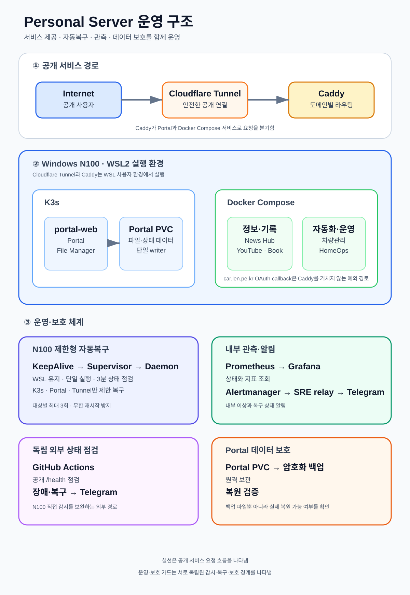
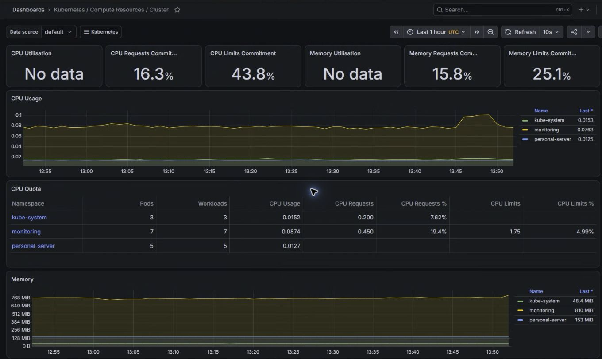

# Personal Server

Windows N100과 Ubuntu WSL2에서 운영하는 개인용 서비스 허브임. 파일·기록·뉴스·차량관리·서버 상태를 한 곳에서 사용하고, 이를 모니터링·자동복구·백업·Telegram 알림을 갖춘 **SRE 운영 체계**로 관리함.

## 개인 서버 기능

| 기능 | 제공 내용 | 실행 위치 |
|---|---|---|
| Portal | 자주 쓰는 서비스의 단일 진입점, 관리자 상태, 공개 포트폴리오 | K3s `portal-web` |
| File Manager | 파일 업로드·정리·검색·ZIP 다운로드 | K3s `portal-web` + PVC |
| News Hub | Investing.com·Google News 수집, 나스닥 관련성 분류, Telegram 중요 뉴스 알림 | `crawler-worker` |
| YouTube Memo | 영상 링크·타임스탬프·메모 기록 | `youtube-memo` |
| Book Memo | 책 검색·목차·독서 메모 관리 | `book-memo` |
| 차량관리 | Hyundai 연동 차량 상태·정비 주기·운행 종료 Telegram 알림 | `car-care-worker` |
| HomeOps | 제한된 컨테이너 진단과 승인된 복구 작업 | `system-agent` + `homeops-executor` |

## 주요 화면

| 포털 대시보드 | 차량관리 Telegram |
|---|---|
|  |  |

| File Manager | News Hub |
|---|---|
|  |  |

| YouTube Memo | Book Memo |
|---|---|
|  |  |

| 관리자 상태 |
|---|
|  |

## 현재 구조



| 구분 | 현재 운영 방식 |
|---|---|
| Portal·파일함·관리자·포트폴리오 | K3s `portal-web` + PVC 단일 writer |
| 뉴스·YouTube 메모·책 메모·차량관리 | Docker Compose |
| 공개 경로 | Cloudflare Tunnel → Caddy → 서비스 |
| 모니터링 | K3s Prometheus·Grafana, Telegram SRE 알림 |
| 백업 | Portal PVC 암호화 백업 및 복원 검증 |
| 외부 장애 감지 | GitHub Actions가 약 5분 간격으로 `https://len.pe.kr/health` 확인 |

## SRE 운영 체계

```text
서비스 실행
  ↓
Prometheus·Grafana로 K3s 상태 관측
  ↓
Alertmanager·SRE relay로 내부 이상 Telegram 알림

GitHub Actions가 외부 주소를 약 5분마다 별도 점검
  ↓
장애·복구 전환 시 Telegram 알림

N100 감시기가 Tunnel 로컬 상태를 3분마다 점검
  ↓
Tunnel 장애·복구 전환 시 Telegram 알림과 제한형 자동복구

Portal PVC 암호화 백업 → 원격 보관 → 복원 검증
```

| SRE 영역 | 적용 내용 |
|---|---|
| 관측성 | Prometheus·Grafana로 K3s 노드·Pod·PVC·서비스 상태 확인 |
| 장애 감지 | 내부 Prometheus 경고와 외부 GitHub Actions health 점검을 분리 |
| 알림 | N100 Tunnel 전환, 외부 health, 내부 경고·백업 결과를 Telegram으로 한국어 전달 |
| 복구 | K3s Pod 자동복구, HomeOps 제한형 컨테이너 복구, 재부팅 뒤 WSL 유지, N100 제한형 자동복구 |
| 데이터 보호 | Portal PVC 암호화 백업과 실제 복원 검증 |
| 안전 배포 | 허용된 Compose 서비스만 CI 성공 뒤 revision 고정 배포·health 검증·1회 rollback |

개인 서버 기능을 직접 제공하는 것과 별도로, 장애를 빨리 발견하고 데이터 손실 가능성을 낮추며 복구 상태를 확인하는 운영 체계를 함께 구축한 구성이 핵심임.

N100의 `personal-server-autostart` 작업은 3분 간격으로 WSL 유지, K3s, Portal, NodePort, Cloudflare Tunnel을 점검함. 같은 항목이 2회 연속 비정상이면 승인된 범위의 복구만 시도하며, 항목별 자동복구 시도는 최대 3회로 제한함. 상태 기록에 실패하면 추가 복구를 중단함. Tunnel 장애 알림 전송이 성공한 경우에만 N100은 이후 Tunnel 정상 전환에서 복구 알림을 1회 보냄. 장애 알림 전송이 실패하면 다음 점검에서 장애 알림을 재시도함. GitHub Actions의 약 5분 외부 health 점검은 독립 보완 경로이므로 같은 장애에서 메시지가 중복될 수 있음. N100 전원·네트워크·WSL 자체가 불가한 물리·호스트 장애는 이 범위의 자동복구 대상이 아님.

## 모니터링 화면

Grafana에서 K3s 네임스페이스별 CPU·메모리 사용량, Pod 수, 요청량·제한값을 확인하는 예시 화면임.



## 빠른 상태 확인

N100 WSL에서 실행함.

```bash
cd /mnt/c/personal-server
curl --fail --silent --show-error https://len.pe.kr/health
sudo k3s kubectl -n personal-server get deploy,pod,pvc
bash infra/k8s/tools/sre-health-audit.sh
```

각 백업·모니터링·Telegram relay의 상세 점검은 [운영 문서 색인](docs/README.md)을 사용함. 비밀번호·토큰·Secret 값은 문서나 명령 출력에 기록하지 않음.

## 개발과 배포

```text
기능 브랜치 → 테스트·독립 검토 → PR → 사용자 병합 승인 → main
```

`crawler-worker`, `youtube-memo`, `book-memo`, `car-care-worker`의 허용된 변경만 N100 안전 자동 배포 대상임. Portal, K3s, Caddy, Secret, PVC, 운영 데이터는 자동 배포 대상이 아니며 별도 운영 절차를 사용함.

병합된 변경은 CI·배포·health 검증과 작업공간 정리까지 확인함. CI artifact와 운영 증적은 90일 보관하며, 장기 보관이 필요한 자료는 별도 증적 저장소로 이전함.

## 검증

```bash
python3 tests/run_service_tests.py
python3 -m unittest tests.test_documentation_index -v
```

## 운영 문서

| 문서 | 내용 |
|---|---|
| [운영 문서 색인](docs/README.md) | 현재 운영 문서의 단일 진입점 |
| [운영 참조](docs/operations-reference.md) | 서비스 구조·공개 경로·일상 점검 |
| [N100 운영 환경](docs/n100-mt4-setup.md) | Windows·WSL2 자동 시작, 제한형 자동복구와 장애 확인 |
| [N100 안전 자동 배포](docs/n100-github-auto-deploy.md) | 허용 Compose 서비스의 CI 기반 배포 |
| [K3s 운영](infra/k8s/README.md) | Portal·Grafana·Telegram SRE·PVC 백업 |
| [공개 상태 Telegram 알림](docs/public-uptime-monitor.md) | 외부 장애·복구 알림 기준 |
