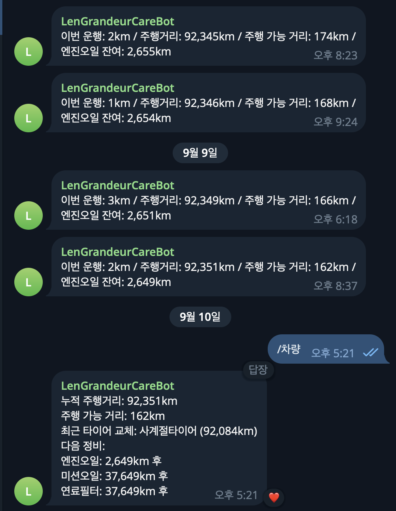

# 🏠 Personal Server

> Windows N100 + WSL2에서 실제 운영 중인 개인용 홈 서버

개인 데이터 관리, 서버 운영, 뉴스·메모, 차량관리를 하나의 Docker Compose 환경에서 운영합니다.

단순히 서비스를 모아 둔 것이 아니라, 기능 변경을 PR·CI·독립 검토·N100 자동배포까지 연결한 운영 프로젝트입니다.

<p align="center">
  
</p>

<br>

## ✨ 한눈에 보기

| 항목 | 내용 |
|---|---|
| 운영 환경 | Windows N100 + Ubuntu WSL2 |
| 서비스 구조 | Docker Compose 기반 서비스별 컨테이너 분리 |
| 대표 기능 | 포털·파일 관리·서버 상태·뉴스·메모·차량관리 Telegram |
| 배포 흐름 | 기능 브랜치 → PR CI·Agent Review → `main` CI → N100 배포·health 검증 |

### 이 프로젝트가 해결하는 일

- **개인 데이터 관리**: 파일·YouTube·책 메모를 각 목적에 맞는 서비스로 관리합니다.
- **운영 자동화**: 서버 상태와 Compose 서비스 상태를 확인하고, 제한된 범위에서 복구합니다.
- **차량관리 자동화**: Hyundai API와 Telegram을 연결해 주행거리·정비 주기·계절 타이어 알림을 관리합니다.

---

<br>

## 🚀 빠른 시작

```bash
cp .env.example .env
docker compose up -d --build
docker compose ps
```

N100 운영 환경, 환경변수, 배포 절차는 [운영 문서 색인](docs/README.md)에서 확인합니다.

<br>

---

<br>

## 🧩 핵심 기능

### 🧭 포털과 개인 데이터

`portal-web`은 서비스의 시작점입니다. 자주 쓰는 링크, 파일함, 서버 상태, 포트폴리오를 한 화면에서 연결합니다.

- **File Manager**: 다중 업로드, 폴더 생성, 검색·정렬, ZIP 다운로드
- **YouTube / Book Memos**: 영상 타임스탬프와 독서 기록 관리
- **Portfolio**: Markdown 기반 공개 포트폴리오와 로그인 후 편집

### 📰 뉴스와 알림

`crawler-worker`는 Investing.com·Google News RSS를 수집하고, 나스닥 관련 기사를 분류해 필요한 기사만 Telegram으로 보냅니다.

시장 충격 가능성이 있는 기사와 전망성 기사를 구분해 알림 피로도를 줄입니다.

### 🚗 차량관리 Telegram

`car-care-worker`는 Telegram long polling으로 동작합니다. Hyundai OAuth 동의 후 주행거리·주행 가능 거리·차량 경고를 조회하고, 정비 주기와 운행 종료 요약을 알려줍니다.

| 자동화 항목 | 동작 |
|---|---|
| 정비 알림 | 엔진오일 10,000km, 미션오일·연료필터 60,000km 주기 / 각 500km 전부터 알림 |
| 계절 타이어 | 매년 11월 15일 윈터타이어, 4월 1일 사계절타이어 교체 알림 |
| 운행 요약 | 주행거리 변화가 멈춘 뒤 운행 거리·주행 가능 거리·엔진오일 잔여 거리 알림 |
| 수동 관리 | Hyundai 연동이 없을 때 `/주행거리 <km>`로 관리 |

 

<details>
<summary><strong>Telegram 명령어와 Hyundai 설정 보기</strong></summary>

<br>

```text
/차량
/정비완료 엔진오일 [km]
/정비완료 미션오일 [km]
/정비완료 연료필터 [km]
/타이어교체 윈터
/타이어교체 사계절
/정비목록
/알림테스트
/현대연결
```

`.env`에는 `CAR_CARE_TELEGRAM_BOT_TOKEN`, `CAR_CARE_TELEGRAM_CHAT_ID`, `HYUNDAI_CLIENT_ID`, `HYUNDAI_CLIENT_SECRET`, `HYUNDAI_REDIRECT_URI=https://car.len.pe.kr/oauth/hyundai/callback`을 설정합니다.

Hyundai OAuth 콜백은 `car.len.pe.kr`에서 Cloudflare Tunnel을 통해 로컬 `8015` 포트로 전달합니다. SQLite 상태는 `data/car-care`에, OAuth 토큰은 Docker named volume `car-care-oauth`의 `/data/oauth`에 분리 저장됩니다.

</details>

### 🛠️ 운영과 안전성

- **System Status**: N100 호스트의 CPU·메모리·디스크·백업·컨테이너 상태 확인
- **HomeOps**: 이 Compose 프로젝트의 서비스만 진단·재시작하고, health check·실행 이력을 관리
- **접근 제어**: 수정 기능에 세션 인증과 Origin 검증 적용
- **데이터 분리**: 운영 데이터와 `.env`는 저장소에 올리지 않으며, 서비스별 경로에 보관

<br>

---

<br>

## 🤖 Harness / Loop Engineering

AI가 코드를 작성하는 것에서 끝내지 않고, 운영 반영까지 검증 가능한 루프로 관리합니다.

```text
요구사항·성공 기준
        ↓
기능 브랜치 구현 · 회귀 테스트
        ↓
독립 검토 · PR CI · Agent Review
        ↓
사용자 병합 승인
        ↓
main CI · N100 자동배포 · health 검증
```

- 변경 범위·제외 범위·성공 기준을 먼저 정의합니다.
- 보안·운영·시간대·중복 발송처럼 놓치기 쉬운 조건은 독립 검토로 확인합니다.
- CI artifact와 로그는 90일 보존하며, 장기 보관이 필요한 증거는 별도 증적 저장소로 옮깁니다. 병합된 PR은 CI·배포 성공 및 작업공간 무변경을 확인한 뒤 정리합니다.

세부 절차는 [Codex 작업 완료 루프](docs/codex-work-loop.md), 증거 운영은 [작업 루프 증거 운영](docs/agent-loop-evidence.md)을 참고합니다.

<br>

---

<br>

## ✅ 검증

GitHub Actions CI에서 포털, 시스템 상태, 뉴스, HomeOps, 메모, 차량관리, Compose와 운영 스크립트의 서비스별 테스트를 실행합니다.

```bash
python3 tests/run_service_tests.py
python3 tests/run_service_tests.py --list
```

특정 서비스만 확인하려면 `--suite`를 사용합니다.

<br>

---

<br>

## 🏗️ 아키텍처와 참고 자료

<details>
<summary><strong>컨테이너 구성과 외부 연결 보기</strong></summary>

<br>

```text
Internet
  └─ Cloudflare Tunnel 또는 Caddy
       └─ Windows N100 + Ubuntu WSL2
            ├─ portal-web       Portal · File Manager · Status · Portfolio
            ├─ system-agent     Host metrics API
            ├─ homeops-executor Restricted Docker diagnostics · restart
            ├─ crawler-worker   RSS collection · archive · notification
            ├─ youtube-memo     Video notes
            ├─ book-memo        Book notes
            └─ car-care-worker  Telegram vehicle-care worker (internal only)
```

공개 HTTPS는 Cloudflare Tunnel 또는 Caddy + Cloudflare DNS-01 중 실제 환경에 맞는 한 가지 방식만 사용합니다.

</details>

<details>
<summary><strong>추가 서비스 화면 보기</strong></summary>

<br>

| File Manager | News Hub |
|---|---|
|  |  |

| YouTube Memo | Book Memo |
|---|---|
|  |  |

</details>

### 기술 스택

| 영역 | 기술 |
|---|---|
| Backend | Python, FastAPI, Jinja2 |
| Storage | SQLite, JSON file storage |
| Infrastructure | Docker Compose, Cloudflare, Caddy, Windows/WSL2 |
| CI/CD | GitHub Actions, Windows self-hosted runner |

<br>

## 🔎 운영 문서

| 문서 | 내용 |
|---|---|
| [운영 문서 색인](docs/README.md) | 운영 문서의 단일 진입점 |
| [운영 참조](docs/operations-reference.md) | 도메인·환경변수·일상 점검 명령 |
| [N100 운영 환경](docs/n100-mt4-setup.md) | Windows·WSL2·Docker 운영 |
| [N100 자동 배포](docs/n100-github-auto-deploy.md) | GitHub Actions 배포와 장애 대응 |
| [프로젝트 포트폴리오 원문](docs/portfolio-content.md) | 공개 포트폴리오용 프로젝트 설명 |
