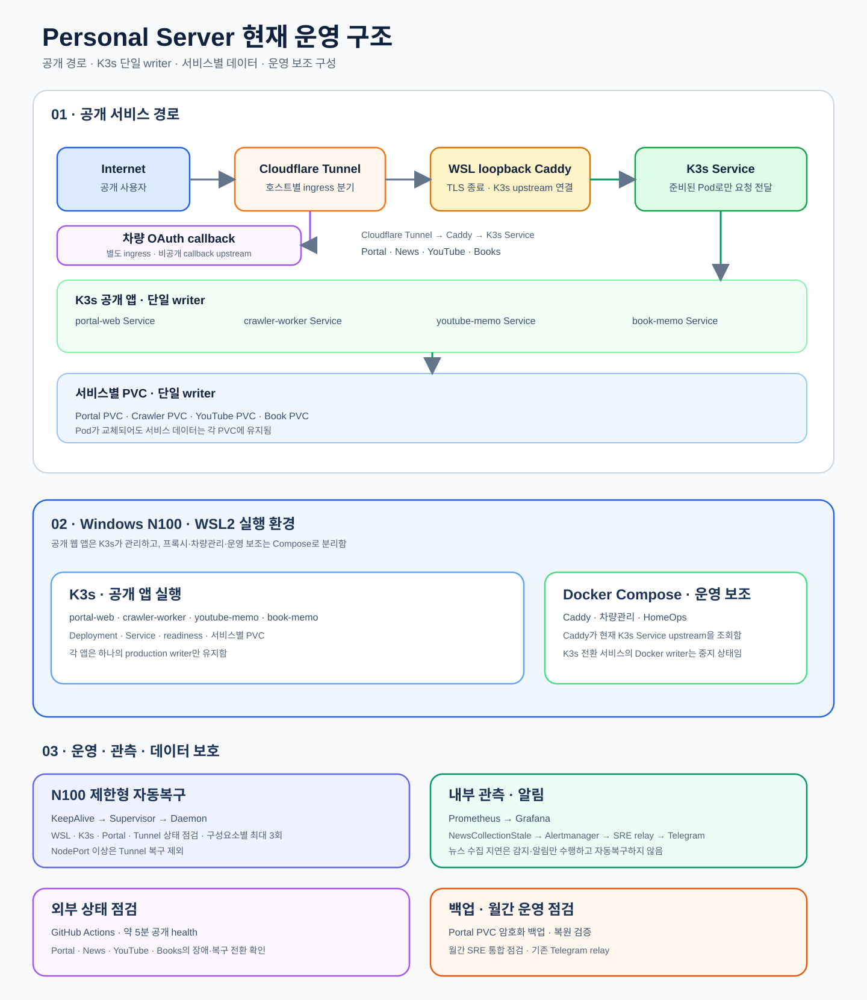

# Personal Server

Windows N100과 Ubuntu WSL2에서 운영하는 개인용 서비스 허브임. 파일·기록·뉴스·차량관리·서버 상태를 한 곳에서 사용하고, 이를 모니터링·자동복구·백업·Telegram 알림을 갖춘 **SRE 운영 체계**로 관리함.

<br>

## 개인 서버 기능

| 기능 | 제공 내용 | 실행 위치 |
|---|---|---|
| Portal | 자주 쓰는 서비스의 단일 진입점, 전체 검색, 관리자 상태, 공개 포트폴리오 | K3s `portal-web` |
| File Manager | 파일 업로드·정리·검색·ZIP 다운로드 | K3s `portal-web` + PVC |
| News Hub | Investing.com·Google News 수집, 수집 최신성 표시, 나스닥 관련성 분류, Telegram 중요 뉴스 알림 | K3s `crawler-worker` + PVC |
| YouTube Memo | 영상 링크·타임스탬프·메모 기록 | K3s `youtube-memo` + PVC |
| Book Memo | 책 검색·목차·독서 메모 관리 | K3s `book-memo` + PVC |
| 차량관리 | Hyundai 연동 차량 상태·정비 주기·운행 종료 Telegram 알림 | `car-care-worker` |
| HomeOps | 제한된 컨테이너 진단과 승인된 복구 작업 | `system-agent` + `homeops-executor` |

<br>

## 검색·뉴스 상태 표시

Portal의 전체 검색은 서비스별 결과를 독립적으로 표시함. 특정 서비스 호출에 실패하면 다른 서비스의 검색 결과는 유지하고, 해당 서비스에는 `현재 응답 없음`을 표시함. 정상 응답이지만 결과가 없는 경우에는 장애로 표시하지 않고 빈 검색 결과로 구분함.

News Hub는 제목 아래에 수집 최신성을 표시함. `마지막 정상 수집` 시각과 최근 수집 실패 횟수를 확인할 수 있으며, 정상 수집 기록이 없으면 해당 상태를 명확히 표시함. 상태 확인용 `GET /api/collection-status`는 초기화 여부, 마지막 시도·성공 시각, 연속 실패 횟수만 반환하며 기사·URL·자격증명은 포함하지 않음.

<br>


## 반영 상태

2026-09-21 확인 기준으로 1~11차 개발의 저장소 반영은 완료함. Book·Portal·차량 변경은 운영 적용·검증까지 완료했으며, 뉴스 10차 알림 영속화는 복구 호환 보완 후 적용 대상으로 남음. SLO 증적 실패는 원인을 확인하고 수정안 검증을 마쳤으나 운영 수집기는 아직 변경하지 않음. [현재 개발 계획](docs/20260921_프로젝트보완_개발계획.md)과 [앱 배포 검증 결과](docs/reviews/20260921_K3s앱배포_검증결과.md)에서 코드 반영과 운영 이미지 적용을 구분함.

## 주요 화면

뉴스·파일함·Book·YouTube·관리자 화면과 이미지 목록의 Portal 화면은 2026-09-21 실제 서비스에서 다시 촬영함. 관리자는 자동복구·HomeOps·보안 정책까지 촬영하며 IP가 포함된 하단 보안 이벤트 목록은 제외함. 차량 Telegram·Grafana는 기존 촬영 예시를 유지함. 화면은 촬영 시점의 표시이며 배포 버전이나 지속적인 서비스 정상 상태를 증명하지 않음. 전체 그림 9개의 촬영 기준과 남은 재촬영 사항은 [이미지 목록](docs/images/README.md)을 따름.

| 뉴스 허브 | 차량 관리 Telegram |
|---|---|
| 최근 수집 성공 시각과 세계 경제·IT·AI 뉴스 주제 선택을 확인함.<br><br> | 운행 기록과 누적 주행거리, 주행 가능 거리, 소모품 정비 시점을 Telegram으로 확인함.<br><br> |

| YouTube Memo | Book Memo |
|---|---|
| 영상 링크 등록과 저장된 영상별 메모 수를 확인함.<br><br> | 책 검색, 내 책장, 목차 체크, 장별 코멘트 기록을 한 화면에서 확인함.<br><br> |

| 파일함 | 관리자 상태 |
|---|---|
| 파일·폴더 생성, 업로드, 다운로드, 검색, 정렬과 선택 삭제를 지원함.<br><br> | 서버 자원, 서비스 Health, 승인형 HomeOps 조치 이력을 확인함.<br><br> |

<br>

## 현재 구조



| 구분 | 현재 운영 방식 |
|---|---|
| Portal·파일함·관리자·포트폴리오 | K3s `portal-web` + PVC 단일 writer |
| 뉴스·YouTube 메모·책 메모 | K3s `crawler-worker`·`youtube-memo`·`book-memo` + 서비스별 PVC 단일 writer |
| 차량관리·HomeOps | Docker Compose |
| 공개 경로 | Cloudflare Tunnel: Portal·뉴스·YouTube 메모·책 메모는 Caddy 경유 K3s Service, 차량 callback은 비공개 upstream |
| 모니터링 | K3s Prometheus·Grafana, Telegram SRE 알림 |
| 백업 | Portal PVC 암호화 백업 및 복원 검증 |
| 외부 장애 감지 | GitHub Actions가 약 5분 간격으로 `https://len.pe.kr/health` 확인 |

### Crawler Worker K3s 현재 운영 기준

뉴스 수집 production writer는 K3s `crawler-worker`이며 `news.len.pe.kr`은 Cloudflare Tunnel → Caddy → K3s Service 경로를 사용함. Docker `crawler-worker`는 중지된 롤백 자산으로만 유지하며, K3s와 동시에 production write를 허용하지 않음. runtime state marker `crawler-worker=k3s`, PVC, Deployment readiness를 함께 확인함. 상세 기준은 [운영 참조](docs/operations-reference.md#뉴스-수집-k3s-현재-운영-기준)를 따름.

<br>

## 빠른 상태 확인

N100 WSL에서 실행함.

```bash
cd /mnt/c/personal-server
curl --fail --silent --show-error https://len.pe.kr/health
sudo k3s kubectl -n personal-server get deploy,pod,pvc
bash infra/k8s/tools/sre-health-audit.sh
```

상세 점검 기준과 장애 대응은 [운영 문서 색인](docs/README.md)을 사용함. 비밀번호·토큰·Secret 값은 문서나 명령 출력에 기록하지 않음.

<br>

## SRE 운영 체계

```text
서비스 실행
  ↓
내부 관측·외부 health 점검·제한형 자동복구·백업 복원 검증
  ↓
Telegram 알림과 운영 문서 기반 대응
```

| SRE 영역 | 적용 내용 |
|---|---|
| 관측성 | Prometheus·Grafana로 K3s 노드·Pod·PVC·서비스 상태 확인 |
| 장애 감지 | 내부 Prometheus 경고와 외부 GitHub Actions health 점검을 분리 |
| 알림 | N100 Tunnel 전환, 외부 health, 내부 경고·백업 결과를 Telegram으로 한국어 전달 |
| 복구 | K3s Pod 자동복구, HomeOps 제한형 컨테이너 복구, 재부팅 뒤 WSL 유지, N100 제한형 자동복구 |
| 데이터 보호 | Portal PVC 암호화 백업과 실제 복원 검증 |
| 안전 배포 | 허용된 Compose 서비스만 CI 성공 뒤 revision 고정 배포·health 검증·1회 rollback |
| 공급망 보안 | GitHub Actions 외부 action을 full SHA로 고정하고, 앱·운영 도구의 Python base image와 Caddy의 build/runtime base image를 digest로 고정함. Trivy filesystem/config scan은 HIGH·CRITICAL 결과를 차단하며 CI에서 검증함 |

개인 서버 기능과 함께 장애 감지·복구·데이터 보호를 운영하는 구성이 핵심임. 자동복구의 세부 조건·제한·예외는 [N100 운영 환경](docs/n100-mt4-setup.md)과 [운영 참조](docs/operations-reference.md)를 따름.

<br>

## 컨테이너 실행 보안

저장소의 앱·운영 도구 Dockerfile 12개는 모두 `USER 10001:10001`을 지정함. 이는 이미지의 실행 사용자 설정이며, 실제 배포 버전과 PVC 접근 권한은 서비스별 운영 검증 결과로 확인함. Caddy는 내부 80·443 포트 binding에 필요한 `NET_BIND_SERVICE` capability만 추가로 사용함.

Portal은 K3s 단일 writer와 PVC를 사용하므로 non-root 이미지 교체 전에 파일·상태 PVC의 UID/GID `10001:10001` 읽기·쓰기·디렉터리 접근 권한을 사전검증함. 권한이 충족되지 않으면 Deployment를 전환하지 않으며, PVC 권한 정렬은 자동 배포 대상이 아닌 별도 운영 작업으로 처리함.

<br>

## 모니터링 예시

Grafana에서 K3s 자원 지표를 확인하는 과거 촬영 예시임. 이미지의 `No data`와 Pod 수는 촬영 당시 표시이며, 현재 지표 수집 성공이나 현재 워크로드 수를 의미하지 않음. 최신 운영 화면 재촬영이 필요함.


<br>

## 개발과 배포

```text
기능 브랜치 → 테스트·독립 검토 → PR → 사용자 병합 승인 → main
```

`crawler-worker`, `youtube-memo`, `book-memo`, `car-care-worker`의 허용된 Compose 변경은 N100 안전 자동 배포 분류 대상임. 다만 현재 K3s runtime인 Crawler Worker·YouTube Memo·Book Memo는 Compose 안전 배포에서 자동으로 생략되며, 별도의 이미지 교체 절차를 사용함. 일반 이미지 교체는 PVC·Secret·Caddy·Tunnel을 유지하며, 최초 전환이나 공개 경로 변경은 각각 별도 범위로 취급함. Portal, K3s, Caddy, Secret, PVC, 운영 데이터는 자동 배포 대상이 아님.

병합된 변경은 CI·배포·health 검증과 작업공간 정리까지 확인함. CI artifact와 운영 증적은 90일 보관하며, 장기 보관이 필요한 자료는 별도 증적 저장소로 이전함.

<br>

## 검증

```bash
python3 tests/run_service_tests.py
python3 -m unittest tests.test_documentation_index -v
```

<br>

## 운영 문서

| 문서 | 내용 |
|---|---|
| [운영 문서 색인](docs/README.md) | 현재 운영 문서의 단일 진입점 |
| [운영 참조](docs/operations-reference.md) | 서비스 구조·공개 경로·일상 점검 |
| [N100 운영 환경](docs/n100-mt4-setup.md) | Windows·WSL2 자동 시작, 제한형 자동복구와 장애 확인 |
| [N100 안전 자동 배포](docs/n100-github-auto-deploy.md) | 허용 Compose 서비스의 CI 기반 배포 |
| [K3s 운영](infra/k8s/README.md) | Portal·Grafana·Telegram SRE·PVC 백업 |
| [공개 상태 Telegram 알림](docs/public-uptime-monitor.md) | 외부 장애·복구 알림 기준 |
