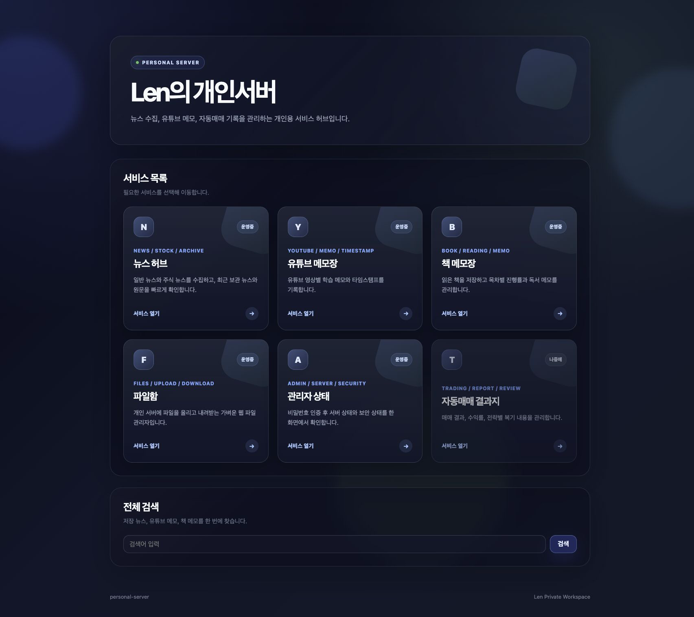
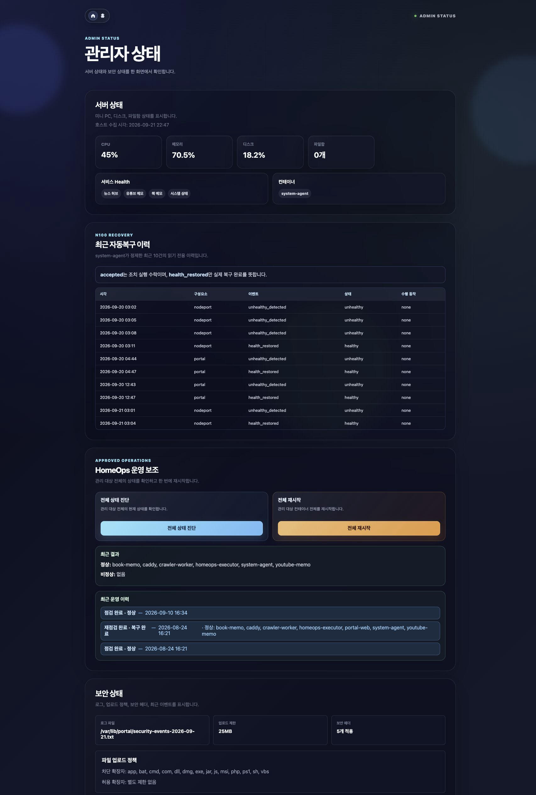
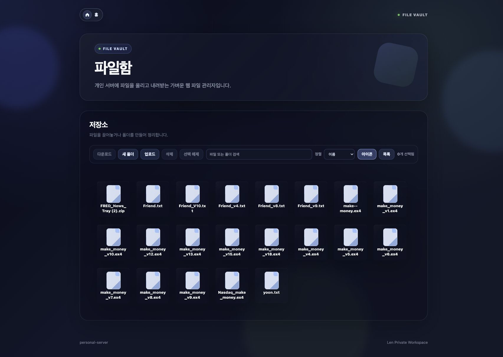
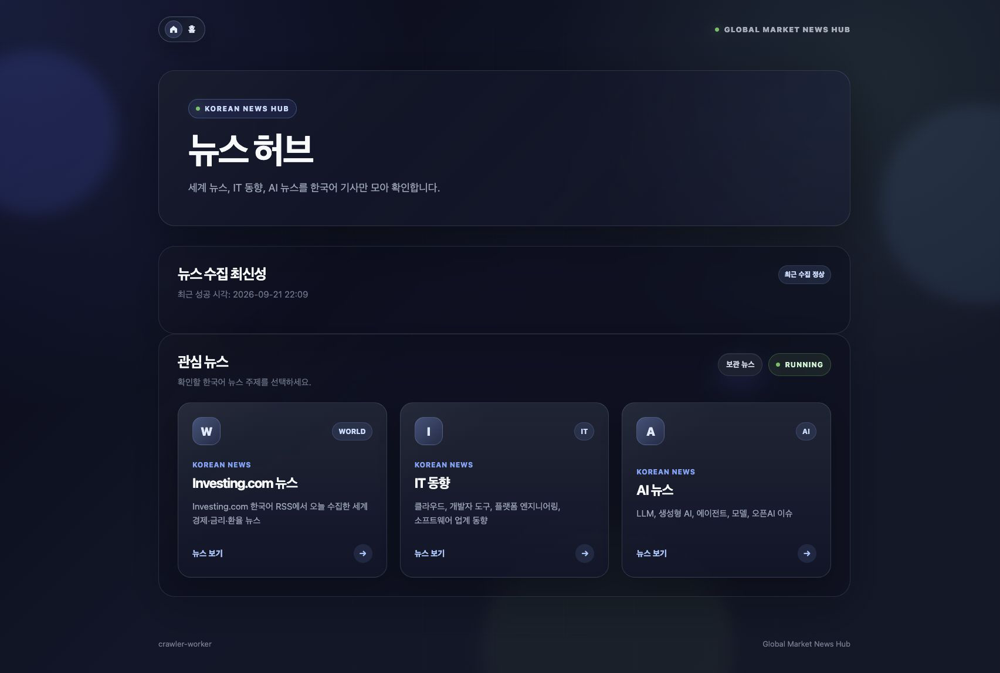
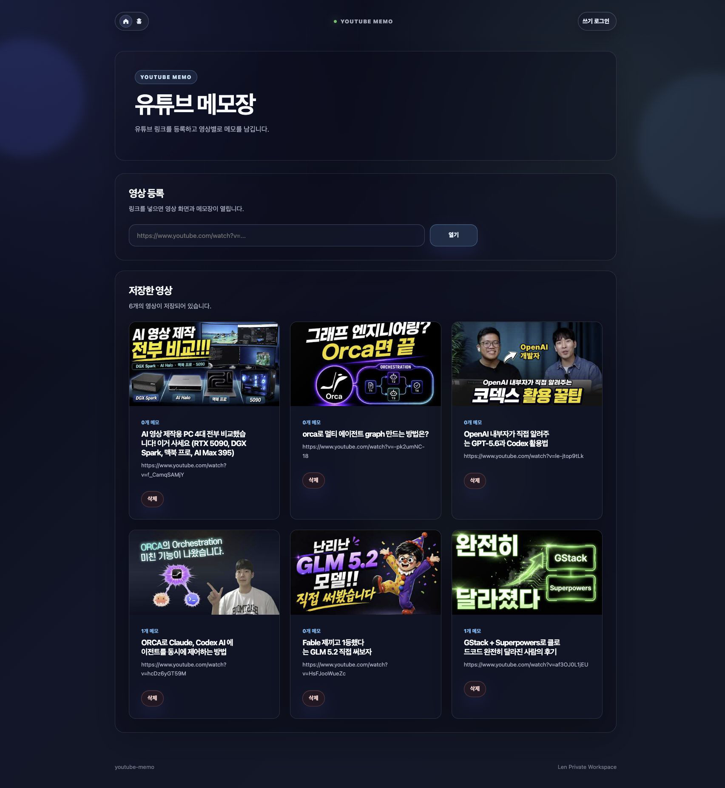
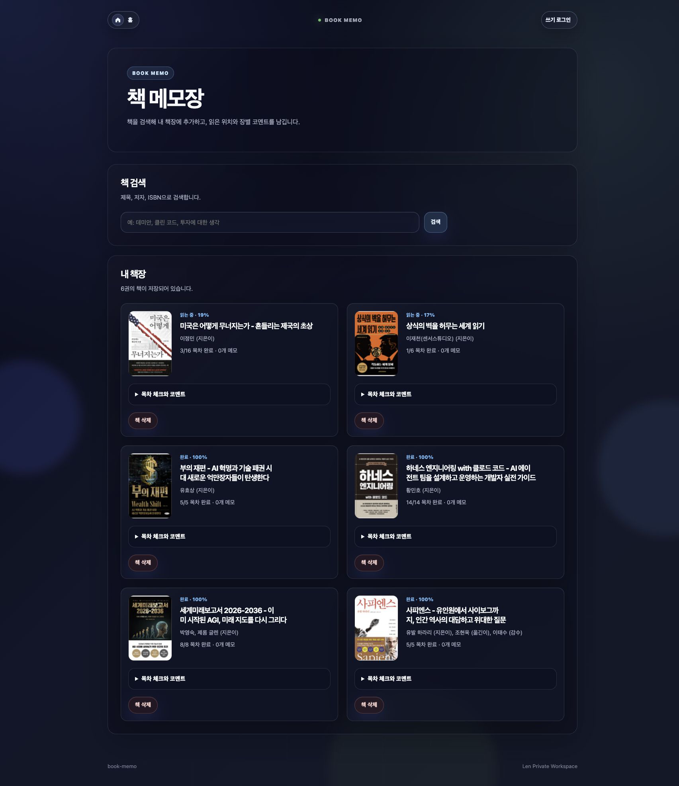

# Personal Server

**OpenAI Codex를 활용한 하네스 엔지니어링 방식으로 설계·구현·검증한 개인 서버 프로젝트임.** 요구사항 분해, TDD, 독립 코드 검토, 보안 재검토, 증적 기반 Git 병합을 개발 루프에 적용함.

Docker Compose로 운영하며 메인 포털, 파일함, 서버 상태, 나스닥 뉴스 알림, YouTube·책 메모, 공개 포트폴리오를 하나의 저장소에서 관리함.

## 1. 구성과 접속 주소

| 서비스 | 역할 | 로컬 개발 | 공개 운영 |
|---|---|---|---|
| 포털 | 서비스 허브·통합 검색 | `http://localhost:8000` | `https://len.pe.kr` |
| 관리자 상태 | 서버·백업·보안 상태 | `http://localhost:8000/admin/status` | `https://admin.len.pe.kr/admin/status` |
| 파일함 | 업로드·다운로드·폴더 관리 | `http://localhost:8000/files` | `https://file.len.pe.kr/files` |
| 뉴스 허브 | Investing.com RSS 수집·보관·알림 | `http://localhost:8001` | `https://news.len.pe.kr` |
| YouTube 메모 | 영상·학습 메모 | `http://localhost:8002` | `https://memo.len.pe.kr` |
| 책 메모 | 책·목차·독서 메모 | `http://localhost:8003` | `https://books.len.pe.kr` |
| 포트폴리오 | 공개 Markdown 포트폴리오 | Host 헤더 기준 | `https://portfolio.len.pe.kr` |
| System Agent | 내부 상태 API | `http://localhost:8010` | 외부 공개하지 않음 |

운영 N100 구성에서는 앱 포트가 `127.0.0.1`에만 열리며 Caddy가 `80`/`443` HTTPS 요청을 각 서비스로 전달함.

## 2. 주요 기능

- 포털: 서비스 이동, 뉴스·YouTube·책 메모 통합 검색, 관리자 상태 진입
- 파일함: 파일/복수 파일 업로드, 드래그 앤 드롭, 폴더 생성, 검색·이름/수정일 정렬, 아이콘/목록 보기, 다운로드·ZIP 일괄 다운로드·삭제
- 관리자 상태: 실제 Windows host 수집 시각(`captured_at`), CPU/메모리/디스크, 백업, 파일함, Docker, 서비스 health, 보안 이벤트 표시
- 뉴스: Investing.com RSS를 보관하고, 확정된 연준·금리/반도체 충격/나스닥 시장 충격만 중요 알림으로 분류
- 텔레그램: 중요(`alert`) 뉴스만 신규 수집 시 전송하며 일일 건수 제한은 없음. 최초 수집은 기준선 생성만 수행함
- YouTube/책 메모: 개인 메모 쓰기는 로그인 세션 후에만 가능하며 읽기·검색은 공개 상태로 유지함
- 포트폴리오: Markdown 편집 후 공개 페이지에 반영하며 원시 HTML은 허용하지 않음

## 화면 예시

| 포털 | 관리자 상태 |
|---|---|
|  |  |
| 파일함 | 뉴스 허브 |
|  |  |
| YouTube 메모 | 책 메모 |
|  |  |

## 3. 빠른 시작 — Mac 로컬 개발

### 3.1 사전 조건

- Docker Desktop 또는 OrbStack 실행 상태
- Git
- Python 3.11 이상: 테스트 실행용
- Node.js: 브라우저 동작 테스트 실행용

### 3.2 환경 파일 생성

```bash
cd /Users/len/PycharmProjects/personal-server
cp .env.example .env
```

`.env`에는 비밀값만 저장하며 Git에 커밋하지 않음. 아래 최소 값을 채움.

```env
DELETE_PASSWORD=<삭제·메모쓰기 비밀번호>
FILE_MANAGER_ACCESS_PASSWORD=<파일함 진입 비밀번호>
ADMIN_STATUS_PASSWORD=<관리자 상태 전용 비밀번호>
PORTFOLIO_ADMIN_PASSWORD=<포트폴리오 편집 비밀번호>
APP_ENV=production
FILE_MANAGER_AUTH_REQUIRED=true
```

`ADMIN_STATUS_PASSWORD`가 설정되면 관리자 상태는 이 값만 사용함. 미설정 시에만 이전 호환용으로 `FILE_MANAGER_PASSWORD`, `DELETE_PASSWORD` 순서로 사용함.

### 3.3 실행·종료·상태 확인

```bash
docker compose up -d --build
docker compose ps
```

종료는 다음과 같음. `-v` 옵션을 사용하지 않으면 데이터 볼륨은 삭제하지 않음.

```bash
docker compose down
```

환경변수만 수정한 뒤 특정 서비스에 반영하려면 컨테이너를 재생성해야 함.

```bash
docker compose up -d --force-recreate portal-web
```

## 4. N100 운영

N100은 Windows + WSL2에서 운영하며 Docker 명령은 WSL 터미널에서 실행함. Windows PowerShell에서 `/mnt/c/...` 또는 Linux Docker 명령을 직접 실행하지 않음.

```bash
cd /mnt/c/personal-server
docker compose -f docker-compose.yml -f docker-compose.n100.yml up -d --build
docker compose -f docker-compose.yml -f docker-compose.n100.yml ps
```

N100 운영 상세는 아래 문서를 기준으로 함.

- [Windows N100 + WSL2 운영](docs/n100-mt4-setup.md)
- [Caddy + Cloudflare HTTPS](docs/caddy-cloudflare.md)
- [Cloudflare Tunnel 대안](docs/cloudflare-tunnel.md)
- [GitHub Actions N100 자동 배포](docs/n100-github-auto-deploy.md)

## 5. 인증과 보안 정책

| 대상 | 인증 방식 | 환경변수 |
|---|---|---|
| 관리자 상태 | 전용 비밀번호 | `ADMIN_STATUS_PASSWORD` |
| 파일함 진입 | 파일함 세션 로그인 | `FILE_MANAGER_ACCESS_PASSWORD` |
| 파일 삭제 | 삭제 비밀번호 재확인 | `DELETE_PASSWORD` |
| YouTube/책 메모 쓰기 | `/auth/login` 세션 로그인 | `DELETE_PASSWORD` |
| 포트폴리오 편집 | 포트폴리오 세션 로그인 | `PORTFOLIO_ADMIN_PASSWORD` |

- 인증 쿠키는 `HttpOnly`, `SameSite=Lax`이며 운영 모드에서는 `Secure`를 적용함.
- 모든 상태 변경 요청은 Origin 검증을 통과해야 함.
- 인증 실패는 기본 5회/300초로 제한하며 JSON 상태 파일과 파일 잠금으로 재시작·동시 요청에도 유지함.
- 파일함은 경로 이탈, 덮어쓰기, 확장자 없는 파일과 위험 확장자를 차단함.
- 포털·뉴스·YouTube·책 서비스는 CSP, 클릭재킹 방지, MIME 스니핑 방지, Referrer·Permissions 정책 헤더를 반환함.

비밀번호·API 키·토큰은 README, 이슈, 채팅, 로그, 커밋 메시지에 기록하지 않음. 노출되었다면 즉시 교체 필요함.

## 6. 환경변수

전체 키와 기본값은 [`.env.example`](.env.example)을 기준으로 함.

| 구분 | 주요 키 | 설명 |
|---|---|---|
| 외부 API | `OPENAI_API_KEY`, `OPENAI_SUMMARY_MODEL`, `ALADIN_TTB_KEY` | AI 요약·도서 검색에 사용 |
| HTTPS | `CADDY_EMAIL`, `CLOUDFLARE_API_TOKEN` | Caddy DNS challenge 운영 시 사용 |
| 뉴스 | `NEWS_REFRESH_INTERVAL_SECONDS`, `NEWS_RETENTION_DAYS`, `NEWS_ARCHIVE_PATH` | 수집 주기·보관 기간·저장 경로 |
| 텔레그램 | `TELEGRAM_BOT_TOKEN`, `TELEGRAM_CHAT_ID` | 중요 나스닥 뉴스 알림 |
| 인증 | `AUTH_RATE_LIMIT_MAX_FAILURES`, `AUTH_RATE_LIMIT_WINDOW_SECONDS`, `AUTH_RATE_LIMIT_STATE_PATH` | 실패 제한과 상태 파일 위치 |
| 메모 세션 | `MEMO_WRITE_SESSION_MAX_AGE`, `AUTH_SESSION_MAX_ENTRIES` | 메모 쓰기 로그인 세션 정책 |
| 상태/백업 | `HOST_METRICS_PATH`, `HOST_METRICS_STALE_SECONDS`, `BACKUP_PATH`, `BACKUP_STALE_SECONDS` | 수집·백업 경고 기준 |

운영 권장값은 아래와 같음.

```env
NEWS_REFRESH_INTERVAL_SECONDS=900
HOST_METRICS_STALE_SECONDS=2100
BACKUP_STALE_SECONDS=172800
AUTH_RATE_LIMIT_MAX_FAILURES=5
AUTH_RATE_LIMIT_WINDOW_SECONDS=300
```

`NEWS_REFRESH_INTERVAL_SECONDS`의 코드 기본값은 300초이므로, 15분 수집을 원하면 `.env`에 `900`을 명시해야 함.

## 7. 뉴스와 텔레그램 정책

뉴스 수집기는 RSS를 주기적으로 보관하고, 기사마다 아래 중 하나로 분류함.

- `alert`: 확정된 연준/FOMC 금리 결과, 확정 반도체 수출 제한·공급 중단, 확정 나스닥/미국 기술주 시장 충격
- `archive`: 일반 뉴스, 전망·가능성·일정 기사, 중요 알림 조건에 맞지 않는 기사

텔레그램은 `alert`와 분류 사유가 있는 신규 기사만 전송함. 토큰 또는 채팅 ID가 비어 있으면 알림을 보내지 않고 뉴스 보관만 수행함.

## 8. 데이터·백업·상태 수집

| 경로 | 내용 |
|---|---|
| `data/crawler-worker/` | 뉴스 SQLite DB·아카이브 |
| `data/youtube-memo/` | YouTube 영상·메모 SQLite DB |
| `data/book-memo/` | 책·목차·메모 SQLite DB |
| `data/files/` | 파일함 업로드·포트폴리오 Markdown |
| `data/system/host-metrics.json` | Windows host collector가 쓴 최신 스냅샷 |
| `data/backups/` | 유지 관리 스크립트의 백업 |
| `data/logs/` | 보안 이벤트와 인증 제한 상태 파일 |

관리자 상태의 host 수집 시간은 페이지 진입 시간이 아니라 `host-metrics.json`의 `captured_at`을 사용함. 파일이 없거나 오래되면 경고를 표시하며 포털 자체는 계속 동작함.

```bash
python3 scripts/maintenance.py backup
python3 scripts/maintenance.py prune-logs
python3 scripts/maintenance.py prune-news
python3 scripts/maintenance.py all
```

## 9. 검증

서비스마다 `app` 패키지 이름이 같으므로 아래처럼 `PYTHONPATH`를 분리해 실행함.

```bash
PYTHONPATH=portal-web python3 -m unittest tests.test_file_access tests.test_portal_dashboard tests.test_portal_security tests.test_portfolio
PYTHONPATH=book-memo python3 -m unittest tests.book_memo.test_book_service tests.book_memo.test_ui_contract
PYTHONPATH=youtube-memo python3 -m unittest tests.youtube_memo.test_ui_contract tests.youtube_memo.test_video_titles
PYTHONPATH=crawler-worker python3 -m unittest discover -s tests/crawler_worker -p 'test_*.py'
PYTHONPATH=system-agent python3 -m unittest discover -s tests/system_agent -p 'test_*.py'
node --test tests/file_explorer_client.test.mjs tests/news_auto_refresh_client.test.mjs
git diff --check
```

## 10. 자주 발생하는 문제

| 증상 | 확인 및 조치 |
|---|---|
| `.env not found` | 현재 Compose 실행 폴더에 `.env`가 있는지 확인함. 작업공간에서는 루트 `.env`를 별도로 연결해야 함. |
| 환경변수를 바꿨는데 로그인 값이 그대로임 | 해당 서비스 컨테이너를 `--force-recreate`로 재생성함. |
| Docker API 연결 실패 | Mac에서는 Docker Desktop/OrbStack을 먼저 실행함. N100에서는 WSL 내부 Docker 상태를 확인함. |
| 컨테이너 이름 충돌 | 이전 스택을 동일 Compose 파일 조합으로 `docker compose down` 한 뒤 다시 올림. |
| host 수집 시간이 오래됨 | Windows collector/작업 상태와 `data/system/host-metrics.json`의 수정 시간을 확인함. |
| 관리자 상태가 비밀번호를 거부함 | `ADMIN_STATUS_PASSWORD` 설정 여부를 확인하고 `portal-web`을 재생성함. |

## 11. AI Engineering 학습·적용 방식

이 프로젝트는 **OpenAI Codex를 유일한 AI 개발 파트너로 사용**해 설계·구현·검증한 개인 서버 프로젝트임. 단순 코드 자동완성이 아니라, AI 에이전트를 개발 하네스(harness) 안에서 운영하는 방식을 실습하는 데 초점을 둠.

### 적용한 AI 엔지니어링 루프

1. 요구사항을 기능·위험도·배포 단위로 분해함.
2. 기능별 격리 작업공간과 주제별 Git 커밋을 사용함.
3. 테스트를 먼저 작성해 RED → GREEN으로 구현함.
4. 구현 에이전트와 독립 검토 에이전트를 분리해 보안·회귀·설계 적합성을 검토함.
5. 중요 지적은 재현 테스트를 만든 뒤 수정하고 재검토함.
6. 전체 테스트와 `git diff --check`를 통과한 변경만 `main`에 병합함.

### 이 프로젝트에서 검증한 사례

- 나스닥 뉴스의 중요도 분류와 텔레그램 알림 정책을 테스트로 고정함.
- 파일함 UX 개선을 기존 업로드·다운로드·삭제 계약을 유지하며 적용함.
- 관리자 상태의 실제 host 수집 시각과 오래됨 경고를 분리함.
- 공개 쓰기 경로의 인증, 세션, CSRF Origin 검증, CSP, 영속형 인증 실패 제한을 단계별 검토로 보강함.
- 코드·설정·운영 문서를 함께 갱신해 실제 배포 가능한 상태로 관리함.

AI가 제안·구현·테스트 보조를 수행하고, 기능 범위·운영 환경값·배포·병합 결정은 프로젝트 운영자가 검토하고 승인함. 이 저장소의 커밋 이력과 테스트는 해당 협업·검증 과정을 확인할 수 있는 실행 증적임.

## 12. 개발 원칙과 인수인계

- 서버 기동 영역과 스케줄러 영역은 수정하지 않음.
- 기능 변경은 테스트 작성 → 실패 확인 → 구현 → 회귀 검증 → 코드 검토 순서로 진행함.
- 새 채팅에서 작업을 이어갈 때는 [Agent Handoff](docs/agent-handoff.md)를 먼저 확인함.
- 상세 운영 보안 점검 결과는 [운영보안 QA 보고서](docs/20260702_운영보안QA_점검보고서.md)를 참고함.
